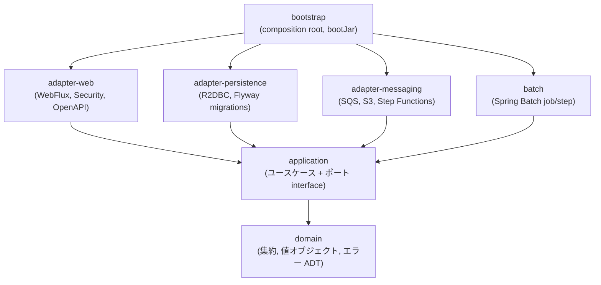
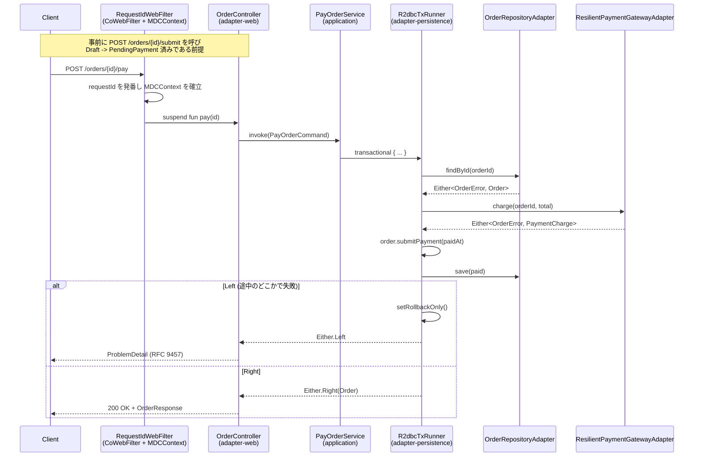
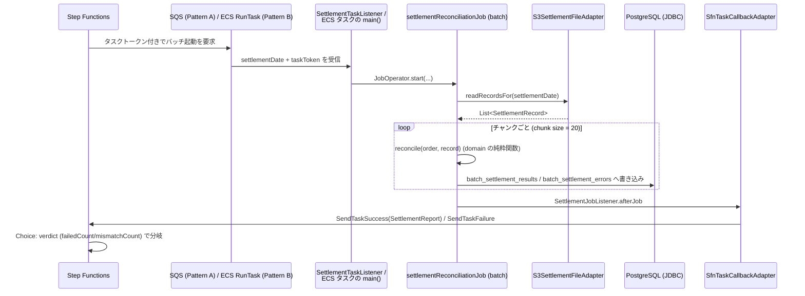
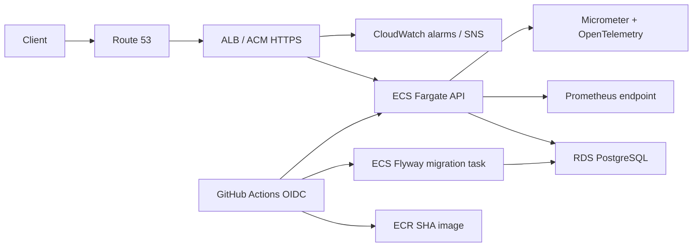

# アーキテクチャ

このドキュメントは、モジュール構成・依存関係のルールとその強制方法、そして代表的な2つのフロー
(Web API のリクエスト処理、消込バッチの実行) を説明する。個々の設計判断の「なぜ」は
`docs/adr/` の各 ADR を参照してほしい。このドキュメントは「全体がどう繋がっているか」の見取り図。

## モジュール構成

`:domain` と `:application` は Spring への依存を一切持たない (`template.kotlin-pure` 規約)。
`:adapter-*` と `:batch` は `:domain`/`:application` に依存してよいが、互いには依存しない
(下記「モジュール間で*依存しない*関係」を参照)。`:bootstrap` だけが全モジュールに依存し、
実際の Bean 解決 (単一の `ApplicationContext`) を組み立てる。

### モジュール間で*依存しない*関係

`settings.gradle.kts` のモジュールグラフには、以下の辺が **存在しない**。

- `:adapter-messaging` → `:batch` (逆向きも無い)
- `:batch` → `:adapter-persistence` (逆向きも無い)
- `:adapter-web` → `:adapter-persistence`/`:adapter-messaging`/`:batch` (相互に無い)

`:adapter-messaging` の `SettlementTaskListener` は `:batch` の `settlementReconciliationJob`
(`Job` Bean) を起動する必要があるが、project 依存を追加せずに Spring Batch という共通の
サードパーティ型 (`Job`/`JobOperator`) だけに依存し、実際の Bean は `:bootstrap` の
単一 `ApplicationContext` の中で解決させている。同様に `:batch` は `SettlementFilePort`
(`:application` のポート interface) を消費するだけで、その実装 (`:adapter-messaging` の
`S3SettlementFileAdapter`) がどのモジュールにあるかを一切知らない。

### 依存ルールがどう強制されているか

ArchUnit や Konsist のような実行時/テスト時のルールチェッカーは使っていない。理由は、
Gradle のモジュール分割そのものが強制力を持つため必要が無いから (ADR 0003 参照)。
`:domain`/`:application` が適用する `template.kotlin-pure` 規約 (build-logic) は
Spring 関連の依存を一切追加しない。誰かがこの2モジュールの中で `org.springframework.*`
を import しようとすると、それは lint 警告ではなく **コンパイルエラー** になる
(クラスパスにそのクラス自体が存在しないため)。

## エラーハンドリングの2軸設計

`domain/error/DomainError.kt` を頂点に、バウンデッドコンテキスト軸 (`OrderError`/
`SettlementError`/`ValueError`) とカテゴリ軸 (`ValidationError`/`NotFoundError`/
`ConflictError`/`InfrastructureError`) が独立して存在する。ユースケース層はバウンデッド
コンテキスト軸で分岐し、`:adapter-web` の `DomainErrorProblemMapper` はカテゴリ軸だけで
HTTP ステータスを決める。詳細は `docs/arrow-style-guide.md` を参照。

ドメインエラーが持つ `message` は診断用であり、Webレスポンスへ直接公開しない。
`:adapter-web` の `DomainErrorProblemMapper` がADTを網羅的に安定エラーコードとmessage keyへ変換し、
`Accept-Language`に応じた日英の文言を生成する。これによりドメイン層をLocaleやSpringの
`MessageSource`から独立させたまま、クライアントには言語非依存の機械可読な契約を提供する。
詳細は `docs/error-handling-and-i18n.md` を参照。

## リクエストフロー: 注文の決済確定 (`POST /orders/{id}/pay`)

`pay` は `Draft -> PendingPayment -> Paid` という注文ライフサイクルの2番目のステップである。
`PayOrderCommand` は対象の注文が `PendingPayment` 状態であることを前提とするため、この図の
シーケンスに入る前に `POST /orders/{id}/submit` (`SubmitOrderForPayment`, `Draft ->
PendingPayment`) を呼んでおく必要がある (下図の Note 参照)。`submit`/`start-fulfillment`/
`ship`/`deliver`/`cancel`/`refund` の各エンドポイントも、決済プロバイダ呼び出しが挟まらない点を
除けば `OrderController -> XxxService -> R2dbcTxRunner -> OrderRepositoryAdapter` という同じ形の
経路を通る。注文の全状態遷移とエンドポイントの対応は `domain/order/OrderTransitions.kt` と
`docs/local-development.md` の動作確認手順を参照。

`either { }` ブロックの中で `.bind()` した値のどれか1つでも `Left` になった時点で、
それ以降のステップ (例えば `save`) は一切呼ばれない。`R2dbcTxRunner` は最終的な結果が
`Left` であれば `setRollbackOnly()` を呼び、途中で書き込んだ行があってもコミットさせない
(詳細は ADR および `docs/testing-strategy.md` の該当箇所を参照)。

## 消込バッチフロー: Step Functions からのトリガー

このテンプレートは2つの起動パターンを両方コード化している (どちらも
`infra/terraform/statemachine/` に ASL 定義がある)。

- **Pattern A (`sqs:sendMessage.waitForTaskToken`)**: ローカル (docker-compose + LocalStack) で
  実際に動かしているのはこちら。LocalStack Community が ECS をサポートしないための選択。
- **Pattern B (`ecs:runTask.waitForTaskToken`)**: 本番運用のデフォルト。Terraform の
  `ecs-task` モジュールが定義するワンショットタスクを Step Functions が直接起動する。
  LocalStack Community では検証できない (`docs/local-development.md` に詳細)。

バッチのコンポーネント (`SettlementRecordItemReader`/`SettlementItemProcessor`/
`SettlementItemWriter`/`SettlementJobListener`) は内部で `runBlocking { }` を使い、
`suspend` なポート (`SettlementFilePort`/`TaskCallbackPort`) を呼び出す。Spring Batch の
ステップ実行スレッドはリアクティブなイベントループではなく専用のワーカースレッドなので、
ここでブロッキングしてもアプリ全体のスループットには影響しない
(WebFlux 側のイベントループと混同しないこと)。

## AWSの実行・デプロイ構成

TerraformはALB/DNS/ECS/RDSと監視の土台を管理し、GitHub Actionsはtask definitionの
イメージrevisionを管理する。ECS serviceの`task_definition`はTerraformの
`ignore_changes`対象で、applyがCIでデプロイ済みのSHA imageを`:latest`へ戻さない。
デプロイはmigration taskの成功後にだけAPIを更新し、最後にreadiness endpointを確認する。

## さらに詳しく

- `docs/arrow-style-guide.md` --- Either/EitherNel の使い分け、`.bindNel()` の罠、optics。
- `docs/testing-strategy.md` --- テストピラミッドと Testcontainers の使いどころ。
- `docs/local-development.md` --- ローカルでこの2つのフローを実際に動かす手順。
- `docs/adr/` --- 個々の設計判断の背景。
